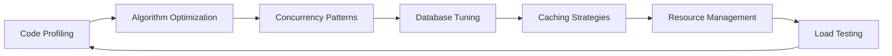

  

  

  <h3>🚀 Transforming Complex Problems into Elegant Solutions • Building Tomorrow's Infrastructure Today</h3>

  
  
  

 

  
  
  
  
  
  
  
  

## 👨‍💻 About Me
Hello! I'm RajaSunrise, a passionate Backend Engineer and Systems Architect from Indonesia. With a strong focus on building resilient and scalable distributed systems, I thrive on solving complex technical challenges and optimizing performance bottlenecks. My approach combines rigorous engineering principles with creative problem-solving to deliver robust solutions.

- 🔭 **Currently Architecting:** Cloud-native microservices ecosystem handling 50k+ RPS
- 🌱 **Deep Diving Into:** Event-driven architectures & real-time data processing
- 💬 **Ask Me About:** High-performance API design, database sharding, and cloud optimization
- ⚡ **Engineering Philosophy:** "Simplicity is the ultimate sophistication" - Da Vinci
- 📫 **Let's Connect:** [indra020204@gmail.com](mailto:indra020204@gmail.com) | [LinkedIn](https://www.linkedin.com/in/indra-aryadi-961a98243)

## 🚀 Core Expertise

### Systems Architecture

  
  
  
  
  

### Performance Optimization

## 🛠️ Technology Stack

### Languages & Frameworks

  
  
  
  
  
  
  
  

### Databases & Data Stores

  
  
  
  
  
  

### DevOps & Cloud Ecosystem

  
  
  
  
  
  
  
  
  

## 🌟 Featured Projects

  
  
  
  
  
  

## 📊 GitHub Analytics

  
  
  
  
  
  
  

## 🌐 Connect With Me

  
  
  
  
  
  

 

  

