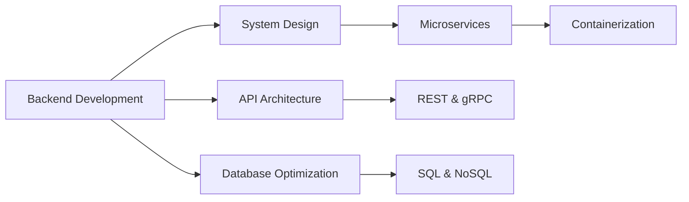

  

<!-- Tagline dengan efek modern -->

  <h3>Building Scalable Systems • Crafting Efficient Solutions</h3>

<!-- Badges teknologi modern -->

  
  
  
  
  
  
  

---
### 👨‍💻 About Me
   Hello! I'm RajaSunrise, a Backend Engineer based in Indonesia with a passion for building efficient and scalable systems. I specialize in designing robust architectures and solving complex technical challenges.
  

🔭 **Currently Working On**: Distributed systems architecture  

🌱 **Learning**: Cloud-native development & advanced system design  

💬 **Ask Me About**: Backend architecture, API design, database optimization  

⚡ **Fun Fact**: I see code as a form of artistic expression
      
 

📫 Reach me: **indra020204@gmail.com**
      
### 🚀 Core Expertise

---

### 🛠️ Tech Stack

#### Languages & Frameworks

  
  
  
  
  

#### Databases

  
  
  
  

#### DevOps & Cloud

  
  
  
  

---

### 📊 GitHub Analytics

<!-- Stats dengan layout modern -->

  
  
  
  
  
  
  

---

### 🌐 Connect With Me

  
  
  
  

<!-- Footer dengan animasi -->

  

